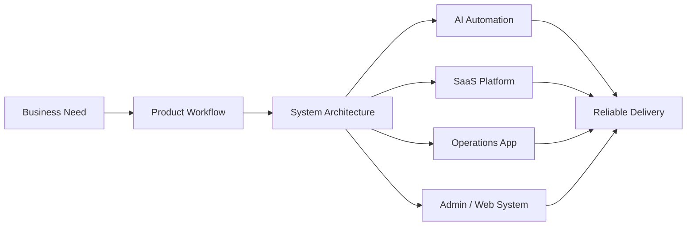

<div align="center">


### Building practical software systems for business, operations, and AI automation

I build business-critical systems: AI agents, SaaS dashboards, internal operations apps, admin tools, and production web/mobile workflows.

<a href="mailto:maruf@b-it.co"></a>
<a href="https://github.com/Mezanur007"></a>
<a href="https://github.com/Mezanur007/my-portfolio"></a>

</div>

---

## 🛰️ Engineering Command Center

<table>
  <tr>
    <td align="center" width="25%">
      <h3>🤖 AI Agents</h3>
      <p>Voice automation, calling flows, AI-assisted review systems.</p>
      
    </td>
    <td align="center" width="25%">
      <h3>☁️ SaaS</h3>
      <p>APIs, tenant dashboards, admin control, customer apps.</p>
      
    </td>
    <td align="center" width="25%">
      <h3>📱 Operations</h3>
      <p>Workforce tools, sales visibility, internal execution systems.</p>
      
    </td>
    <td align="center" width="25%">
      <h3>🌐 Web Systems</h3>
      <p>Lead capture, chat, booking, certificates, PDF/export flows.</p>
      
    </td>
  </tr>
</table>

## ⚙️ Engineering Stack

<p align="center">
  
</p>

<p align="center">
  
  
  
  
</p>

## 🧭 Professional Focus

| Icon | Discipline | What I Build |
| --- | --- | --- |
| 🤖 | **AI Automation** | Voice/calling agents, workflow automation, AI-assisted engineering review systems |
| ☁️ | **SaaS Platforms** | APIs, tenant dashboards, admin consoles, customer mobile experiences |
| 📱 | **Business Operations** | Workforce apps, sales visibility, reporting, internal coordination tools |
| 🌐 | **Web Systems** | Lead capture, admin chat, meeting flows, PDF/export, certificates, legal pages |



## 🚀 Public Proof

| Project | Signal | Contribution |
| --- | --- | --- |
| 🧑‍⚖️ [Senior Engineering Board for Codex](https://github.com/Mezanur007/codex-senior-engineering-board) | `Codex Skill` | Adversarial engineering audit workflow for codebase, PR, architecture, and launch-readiness review. |
| 📚 [tldr-pages: try-rs](https://github.com/tldr-pages/tldr/pull/22732) | `Merged OSS PR` | Added the `try-rs` command page to `tldr-pages/tldr`. |
| 🧪 Flutter contribution attempts | `OSS Triage` | Contribution-flow and issue-triage experience through duplicate PR handling; not presented as merged Flutter work. |

## 🧩 Systems Portfolio

| System | Representative Work | Engineering Value |
| --- | --- | --- |
| 🤖 **AI Calling & Automation** | [Calling Agent](https://github.com/Mezanur007/calling-agent), restaurant calling assistant work, Amanah AI Platform | Structured call handling, automated workflows, operational handoff |
| ☁️ **SaaS / Multi-Tenant Products** | Smart Coordinator Suite | API services, SaaS admin, tenant dashboard, customer mobile flow |
| 📱 **Internal Operations Apps** | B-IT PulseWork, Sales Monitor / Sales App | Workforce coordination, field visibility, reporting, daily execution control |
| 🌐 **Business Web & Admin** | BIT Website / Admin / Chat | Lead capture, guided chat, meeting scheduling, PDF/export, certificates, legal pages |
| 🛠️ **Developer & Portfolio Tools** | [Personal Portfolio Site](https://github.com/Mezanur007/my-portfolio), Codex workflow tooling | Bilingual Vue/Vite UI, public-safe project presentation, engineering review automation |

## 🧠 Operating Style

```text
Product clarity -> simple architecture -> fast iteration -> operational reliability
```

> I use AI as an engineering accelerator, but I still value review discipline, maintainability, and production-safe decisions.

<p>
  
  
  
  
</p>


